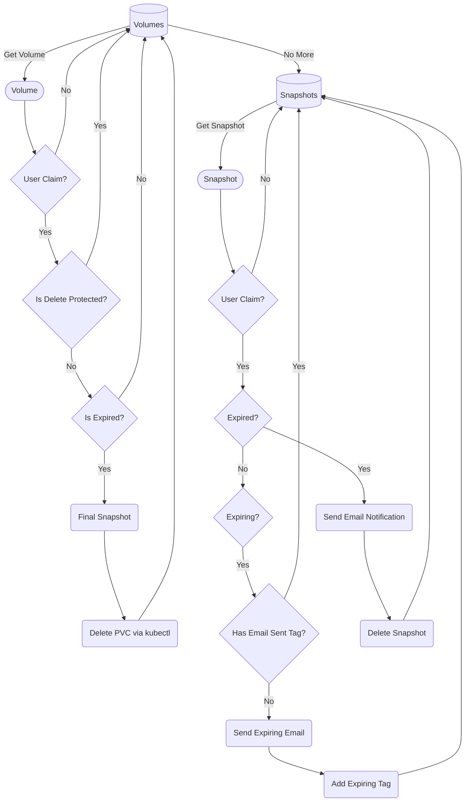

# Volume Management Lambda

## General Flow

```mermaid
flowchart TD
    A[(Volumes)] -->|Get Volume| B([Volume])
    B --> C{User Claim?}
    C -->|No| A
    C -->|Yes| D{Is Delete Protected?}
    D -->|Yes| A
    D -->|No| F{Is Expired?}
    F -->|No| A
    F -->|Yes| E(Final Snapshot)
    E --> G(Delete PVC via kubectl)
    G --> A
    A -->|No More| J[(Snapshots)]
    J -->|Get Snapshot| K([Snapshot])
    K --> L{User Claim?}
    L -->|No| J
    L -->|Yes| M{Expired?}
    M -->|Yes| M1(Send Email Notification)
    M -->|No| N{Expiring?}
    N -->|Yes| O{Has Email Sent Tag?}
    O -->|No| P(Send Expiring Email)
    P --> Q(Add Expiring Tag)
    M1 --> M2(Delete Snapshot)
    M2 --> J
    O -->|Yes| J
    Q --> J
```